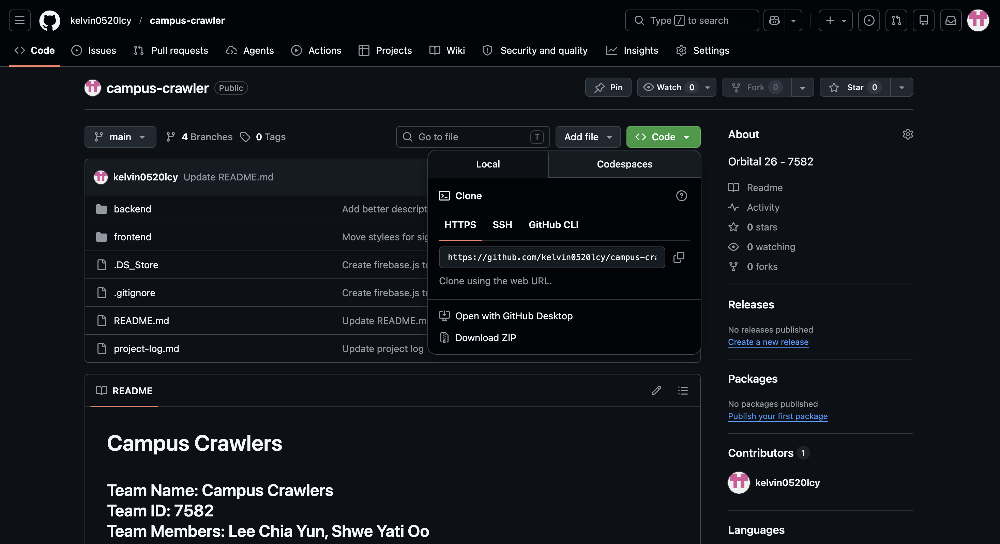
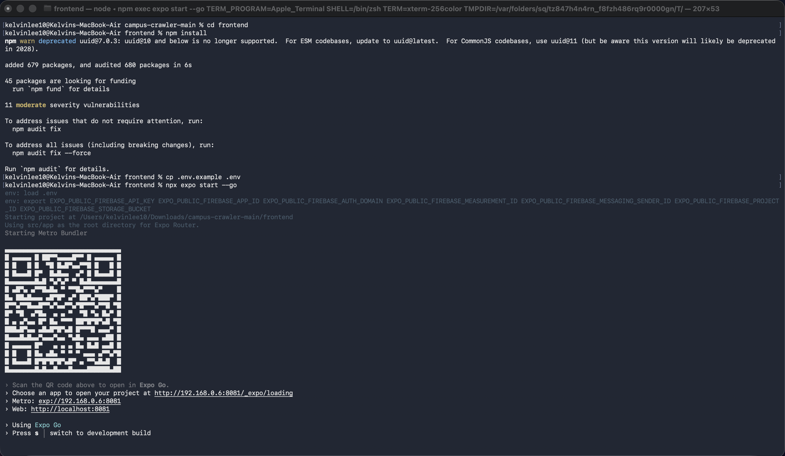
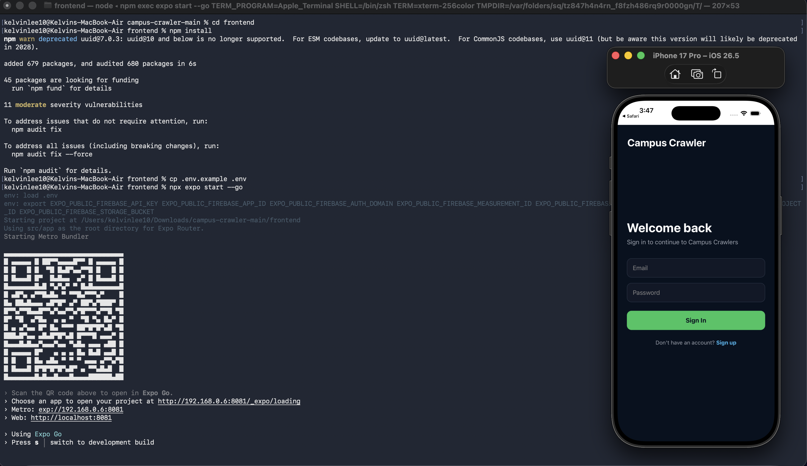
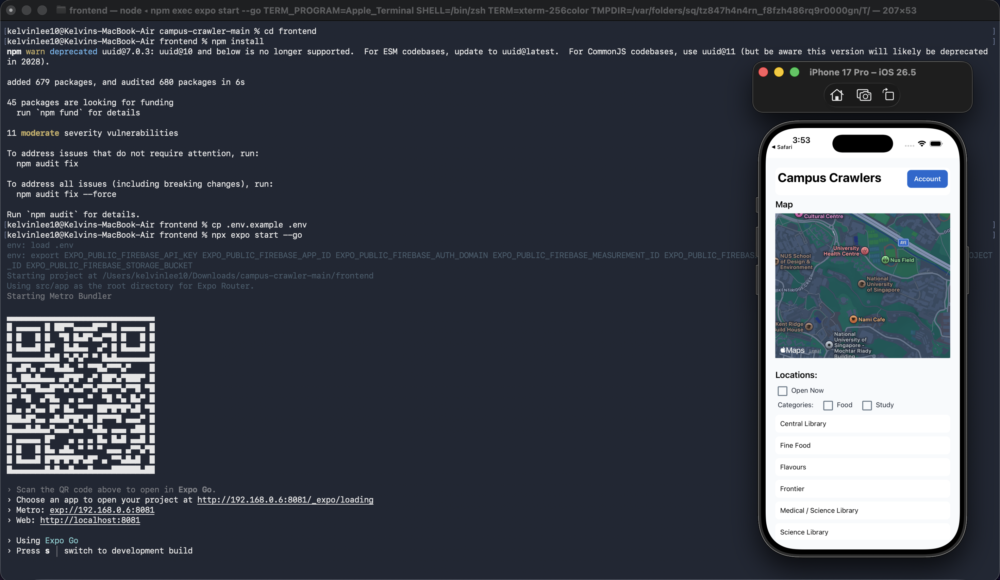

# Campus Crawlers
  
**Team Name:** Campus Crawlers  
**Team ID:** 7582  
**Team Members:** Lee Chia Yun, Shwe Yati Oo  
**Project Type:** Mobile Application  
**Repository:** `https://github.com/kelvin0520lcy/campus-crawler.git`
---

For instructions on how to run and access the app, please refer to [Section 5.3: Running and Accessing the Application](#53-running-and-accessing-the-application).

## Index

* [1. Project Overview](#1-project-overview)
* [2. Problem Motivation and Target Users](#2-problem-motivation-and-target-users)
* [3. User Stories](#3-user-stories)
* [4. Features](#4-features)

  * [4.1 Core Features](#41-core-features)
  * [4.2 Planned Extension Features](#42-planned-extension-features)
* [5. Scope and Progress](#5-milestone-1-scope-and-progress)

  * [5.1 Completed Work](#51-completed-work)
  * [5.2 Technical Proof of Concept](#52-technical-proof-of-concept)
  * [5.3 Running and Accessing the Application](#53-running-and-accessing-the-application)
  * [5.4 Not Yet Completed](#54-not-yet-completed)
* [6. Tech Stack](#6-tech-stack)
* [7. System Design](#7-system-design)

  * [7.1 High-Level Architecture](#71-high-level-architecture)
  * [7.2 Main Components](#72-main-components)
* [8. Data Model and API Design](#8-data-model-and-api-design)

  * [8.1 Location Data Model](#81-location-data-model)
  * [8.2 Current API Endpoints](#82-current-api-endpoints)
  * [8.3 Planned API Endpoints](#83-planned-api-endpoints)
* [9. Testing](#9-testing)

  * [9.1 Current Manual Testing](#91-current-manual-testing)
  * [9.2 Future Testing Plan](#92-future-testing-plan)
* [10. Development Plan](#10-development-plan)
* [11. Future Improvements](#11-future-improvements)


## 1. Project Overview

Campus Crawlers is a mobile application that helps NUS students find campus locations that are currently open, such as food places, study spaces, cafés, canteens, and other useful facilities. The app combines a location list, category filters, opening status, expandable details, and an interactive map so that users can decide where to go before physically walking there.

The main problem we are solving is uncertainty. Students often want to study or eat somewhere on campus, especially during weekends, late evenings, public holidays, or less busy periods, but they may not know whether a specific place or stall is open. Campus Crawlers aims to reduce wasted trips by giving students a quick way to check available places and view their location on a map.

For Milestone 1, we focused on building a technical proof of concept rather than a complete final product. Our goal was to prove that the main technical components can work together: a React Native frontend, an Express backend, Firebase Authentication, Firestore location data, and a map interface.

---

## 2. Problem Motivation and Target Users

As students living on or near campus, we sometimes want to leave our rooms to study, get food, or explore NUS. However, it is not always easy to know whether a specific canteen, food stall, café, or study space is actually open. General campus information may exist, but it is often not specific enough for the real decision a student needs to make. For example, a canteen may be listed as open, but many stalls inside it may already be closed. A study space may have different operating hours during weekends or holidays.

This creates a common inconvenience: a student may walk across campus only to discover that the place is closed, unsuitable, or not offering what they expected. This is especially frustrating because moving between residences, faculties, libraries, and canteens can take time.

The main target users are:

| User Group | Need |
|---|---|
| Students staying in halls or residences | Find food and study spaces without unnecessary trips. |
| International students | Discover available campus places during weekends or holidays. |
| Students studying late | Know which spaces or food places remain open. |
| Students looking for food | Check canteens, cafés, and future stall-level availability. |
| Freshmen | Understand campus locations and opening patterns more easily. |

---

## 3. User Stories

| No. | User Story |
|---|---|
| 1 | As a student staying on campus, I want to see study spaces that are currently open so that I can choose a place without wasting time. | 
| 2 | As a student looking for food, I want to see which canteens and stalls are open so that I can decide where to go before walking there. |
| 3 | As a student who prefers nearby places, I want to filter locations by distance so that I can quickly find convenient options. |
| 4 | As a student using the app at night or during weekends, I want to filter for places that are open during those times. |
| 5 | As a student who notices that a place is unexpectedly open or closed, I want to submit an update so that other users can benefit from more accurate information. |
| 6 | As a regular user, I want to bookmark my favourite places so that I can access them quickly later. |
| 7 | As a user viewing a location list, I want to expand a location to read more details so that I can understand what the place offers. |
| 8 | As a user viewing a map, I want the selected location to appear as a marker so that I can visually understand where it is. |

---

## 4. Features

### 4.1 Core Features

**Open-Now Places Display**  
The app displays campus locations and allows users to filter places that are currently open. For Milestone 1, a simple open-now filter has been implemented. In later milestones, this logic will be improved to handle more complex cases such as multiple opening intervals, weekends, public holidays, and special schedules.

**Interactive Campus Map**  
The app includes a map view using `react-native-maps`. Users can select a location from the list and see the corresponding marker on the map. This proves that the location coordinates stored in the database can be used by the frontend to display real campus locations.

**Filtering System**  
The app currently supports simple filtering by open-now availability and category. This is an early version of the final filtering system. Future versions will include distance, tags, weekend availability, and possibly search.

**Location Details Display**  
Each listed location can be expanded to show more information, such as its description. This keeps the main list compact while still letting users view extra details when needed.

**Authentication**  
Firebase Authentication is used for basic sign-up and sign-in. This prepares the system for future account-based features such as bookmarks, user-submitted reports, ratings, and reviews.

### 4.2 Planned Extension Features

| Feature | Purpose |
|---|---|
| Stall-Level Availability | Show individual stall opening status inside canteens instead of only canteen-level status. |
| Crowd-Sourced Status Updates | Allow users to report whether a location is open, closed, crowded, or quiet. |
| Bookmarks / Favourites | Let users save frequently visited places. |
| Remaining Opening Time | Show how long a location will remain open. |
| Ratings and Reviews | Let users share feedback about places. |
| Hidden Places Forum | Let users share lesser-known campus spots. |
| Walking Directions | Guide users from their current location to the selected destination. |

---

## 5. Milestone 1 Scope and Progress

For Milestone 1, the main goal is to complete a technical proof of concept. The project is not expected to be fully polished yet. Instead, our focus is to show that the main system architecture is feasible and that the core components can communicate with each other.

### 5.1 Completed Work

| Area | Status | Details |
|---|---|---|
| Backend server | Done | Express server created and tested. |
| Firebase integration | Done | Backend connected to Firestore. |
| Firestore sample data | Done | Sample campus places added through a seeding file. |
| Authentication | Done | Firebase Authentication integrated and tested. |
| Location API | Done | Routes and controllers added to fetch all locations and get location by ID. |
| Frontend map | Done | `react-native-maps` added to the homepage. |
| Filtering system | Done | Simple availability and category filter added. |
| Account page | Done | Account information moved into a separate page. |
| Deployment | Done | Backend server deployed to Render and frontend API URL updated. |

### 5.2 Technical Proof of Concept

The current proof of concept demonstrates this flow:

1. The user opens the React Native mobile app.
2. The user signs up or signs in using Firebase Authentication.
3. The frontend fetches campus location data from the backend.
4. The backend retrieves sample location data from Firestore.
5. The frontend displays the locations in a list and on a map.
6. The user filters locations by open-now status or category.
7. The user taps a location to expand its description.
8. The selected location is shown on the map with a marker.

### 5.3 Running and Accessing the Application

For Milestone 1, the backend server has already been deployed on Render. Therefore, the evaluator does not need to run the backend locally in order to test the main proof of concept. The mobile frontend is configured to communicate with the deployed backend, which retrieves campus location data from Firestore.

#### 5.3.1 Downloading the Project

To run the app locally, first download the project from the GitHub repository.

1. Go to the project repository:

```text
https://github.com/kelvin0520lcy/campus-crawler.git
```

2. Click the green **Code** button.

3. Select **Download ZIP**.

4. After the ZIP file is downloaded, extract it to a folder on your computer.

5. Open a terminal in the extracted project folder.



#### 5.3.2 Backend Access

The backend is hosted on Render.

```text
Deployed backend URL: https://campus-crawler.onrender.com
```

A basic health check endpoint is available to verify that the backend server is running:

```text
GET https://campus-crawler.onrender.com/api/health
```

The main location endpoint used by the frontend is:

```text
GET https://campus-crawler.onrender.com/api/locations
```

This endpoint retrieves the sample campus locations stored in Firestore and returns them to the mobile app.

**Note:** The backend server is hosted on Render and may go to sleep after a period of inactivity. If the app does not fetch location data immediately, please wait for a short while and try again, as the server may need some time to restart.

#### 5.3.3 Frontend Setup

To run the mobile frontend locally, navigate to the frontend folder and install the required dependencies:

```bash
cd frontend
npm install
```

Before running the frontend, create a `.env` file inside the `frontend` folder.

You can copy the provided example file:

```bash
cp .env.example .env
```

Then start the frontend on Expo go:

```bash
npx expo start --go
```



After Expo starts, the app can be opened using an iOS Simulator, Android Emulator, or a physical device with Expo Go.



For setting up Expo Go or an emulator/simulator, please refer to the official Expo guides below:

* **Windows:** Please refer to the [Expo Android Studio Emulator guide](https://docs.expo.dev/workflow/android-studio-emulator/) to set up and run the app on an Android Emulator.
* **macOS:** Please refer to the [Expo iOS Simulator guide](https://docs.expo.dev/workflow/ios-simulator/) to set up and run the app on an iOS Simulator.
* **Physical device:** Please refer to the [Expo Go page](https://expo.dev/go) to install Expo Go on your Android or iOS device.

#### 5.3.4 Accessing the App

Once the mobile app is opened, the user can access the proof of concept through the following steps:

1. Sign up or sign in using an email and password.
2. After authentication, the user will be directed to the home page.
3. The home page displays the campus map and a list of campus locations.
4. The frontend fetches location data from the deployed Render backend.
5. Users can filter locations by category or open-now availability.
6. Users can tap a location from the list to show its marker on the map.
7. Users can expand a location card to view its description and additional details.



### 5.4 Not Yet Completed

The following features are planned for later milestones:

- Full stall-level database.
- Full distance-based filtering.
- User location permission and distance calculation.
- Crowd-sourced open/closed reports.
- Ratings and reviews.
- Favourite/bookmark system.
- Walking directions.
- Automated testing.
- Larger and more accurate NUS location dataset.
- More polished UI/UX.

---

## 6. Tech Stack

| Area | Technology | Purpose |
|---|---|---|
| Mobile Frontend | React Native | Build the mobile app interface. |
| Development Framework | Expo | Simplify React Native development and testing. |
| Authentication | Firebase Authentication | Handle user sign-up, login, logout, and session state. |
| Database | Firebase Firestore | Store location data, opening hours, tags, and future user updates. |
| Backend | Node.js and Express.js | Provide API endpoints and server-side data access. |
| Map | React Native Maps | Display campus locations on an interactive map. |
| Deployment | Render | Host the backend server for easier demonstration. |
| Version Control | Git and GitHub | Track progress, manage branches, and collaborate. |

---

## 7. System Design

### 7.1 High-Level Architecture

```text
User
 |
 | interacts with
 v
React Native Mobile App
 |
 | Firebase Auth for login/signup
 | API request for locations
 v
Express Backend Server
 |
 | reads/writes data
 v
Firebase Firestore
 |
 | stores
 v
Locations, Opening Hours, Tags
```

### 7.2 Main Components

**Frontend**  
The frontend displays authentication screens, the homepage, map view, location list, filters, account page, and expandable location details. It uses React state and a custom `useLocations` hook to manage location data.

**Authentication**  
Firebase Authentication handles sign-up, sign-in, logout, and user session state. Authentication is important because future features such as bookmarks and user reports require a reliable user identity.

**Backend**  
The backend is built with Express. It contains routes and controllers for retrieving location data from Firestore. This keeps database logic separate from frontend UI code.

**Database**  
Firestore stores sample campus locations. Each location includes basic information such as name, category, description, coordinates, opening hours, and tags.

**Map Interaction**  
The app uses stored coordinates to display a marker when a location is selected. In later milestones, the map will support better marker interaction, user location, and possibly walking directions.

---

## 8. Data Model and API Design

### 8.1 Location Data Model

Example Firestore document:

```js
locations/{locationId} = {
  name: "Frontier Canteen",
  category: "food",
  description: "Canteen near Faculty of Science",
  location: {
    latitude: 1.2966,
    longitude: 103.7764
  },
  openingHours: {
    monday: [{ open: "08:00", close: "20:00" }],
    tuesday: [{ open: "08:00", close: "20:00" }],
    saturday: [{ open: "10:00", close: "15:00" }]
  },
  tags: ["food", "canteen", "weekend"],
  createdAt: timestamp,
  updatedAt: timestamp
}
```

The document ID is used as the location ID. This makes it easier to fetch one specific location through the backend using `/api/locations/:id`.

### 8.2 Current API Endpoints

| Method | Endpoint | Purpose |
|---|---|---|
| GET | `/api/health` | Check whether the backend is running. |
| GET | `/api/locations` | Retrieve all campus locations. |
| GET | `/api/locations/:id` | Retrieve one location by ID. |

### 8.3 Planned API Endpoints

| Method | Endpoint | Purpose |
|---|---|---|
| GET | `/api/locations/open-now` | Retrieve currently open locations. |
| POST | `/api/reports` | Submit a user open/closed report. |
| POST | `/api/favourites` | Save a favourite location. |
| GET | `/api/stalls/:locationId` | Retrieve stall information for a canteen. |
| POST | `/api/reviews` | Submit a rating or review. |

---
## 9. Testing

For Milestone 1, testing is mainly manual because the focus is on verifying the technical proof of concept. Automated tests will be added in later milestones after the core feature structure becomes more stable.

### 9.1 Current Manual Testing

| Test Area | Test Case | Expected Result |
|---|---|---|
| Backend | Start server locally. | Server runs successfully. |
| Backend | Call `/api/health`. | Server returns a success response. |
| Firestore | Run seed script. | Sample locations are added to Firestore. |
| Location API | Call `/api/locations`. | Backend returns campus location data. |
| Authentication | Sign up with email and password. | Account is created successfully. |
| Authentication | Sign in with valid account. | User can access the app. |
| Frontend | Open homepage. | Location data is displayed. |
| Filtering | Select open-now/category filter. | Displayed locations update correctly. |
| Map | Select a location. | Marker appears or moves on the map. |
| UI | Expand a location. | Description is shown correctly. |

### 9.2 Future Testing Plan

For Milestone 2 and Milestone 3, we plan to add:

- Unit tests for opening-hour and filtering logic.
- Integration tests for backend API endpoints.
- System testing for complete user flows.
- User testing with NUS students.
- Edge-case testing for closed days, missing data, and special opening hours.

---

## 10. Development Plan

### Milestone 1: Ideation and Technical Proof of Concept

- Finalize problem motivation and user stories.
- Set up frontend and backend project structure.
- Integrate Firebase Authentication.
- Connect backend to Firestore.
- Add sample campus location data.
- Build basic map and location list.
- Implement basic filtering and expandable details.
- Deploy backend for demonstration.
- Document system design and progress.

### Milestone 2: Prototype

- Expand the location database.
- Improve map marker interaction.
- Add location detail pages or better detail cards.
- Implement distance and tag filtering.
- Add basic stall-level availability.
- Improve UI design and layout.
- Add more systematic testing.

### Milestone 3: Extension

- Add crowd-sourced reports.
- Add confidence indicator for reported status.
- Add favourites/bookmarks.
- Add ratings and reviews.
- Add walking directions if feasible.
- Conduct user testing.
- Fix bugs and polish the interface.

---

## 11. Future Improvements

The most important next step is to turn the proof of concept into a more complete prototype. This means improving both the dataset and the user experience. We plan to add more NUS locations, support more accurate opening-hour logic, improve the map interface, and build stronger filtering features.

After the main prototype is stable, we will work on extension features such as crowd-sourced status updates, favourites, reviews, confidence indicators, and walking directions. These features will make the app more useful beyond static opening-hour data.

---
